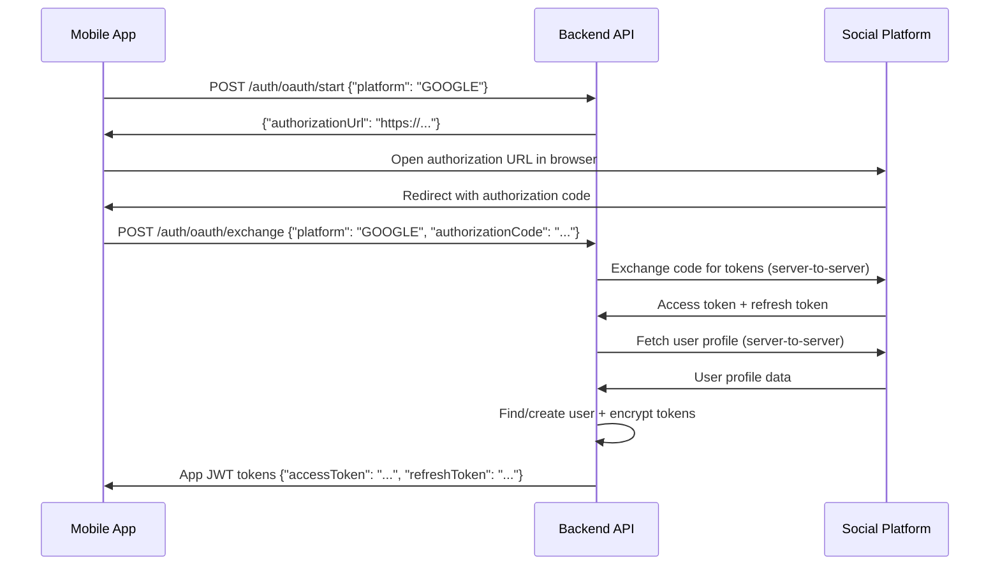

# OAuth Social Media Authentication

This document describes the OAuth implementation for social media authentication in the FeedMerge API.

## Overview

The API provides secure OAuth authentication for the following social media platforms:
- **Google/YouTube** - Full email and profile access
- **Facebook** - Basic profile and email access
- **TikTok** - Basic profile access (email not available)

## Security Features

✅ **Client secrets remain on backend only** - Mobile app never handles sensitive credentials  
✅ **AES-256 encryption** - All social tokens encrypted before database storage  
✅ **JWT session management** - App issues its own tokens for mobile client sessions  
✅ **Environment variables** - All sensitive keys loaded from secure environment  

## API Endpoints

### 1. Start OAuth Flow
```http
POST /api/v1/auth/oauth/start
Content-Type: application/json

{
  "platform": "GOOGLE" | "FACEBOOK" | "TIKTOK"
}
```

**Response:**
```json
{
  "authorizationUrl": "https://accounts.google.com/o/oauth2/v2/auth?client_id=..."
}
```

**Usage:** Mobile app calls this endpoint to get the authorization URL, then opens it in an in-app browser.

### 2. Exchange Authorization Code
```http
POST /api/v1/auth/oauth/exchange
Content-Type: application/json

{
  "platform": "GOOGLE" | "FACEBOOK" | "TIKTOK",
  "authorizationCode": "4/0AX4XfWh..."
}
```

**Response:**
```json
{
  "accessToken": "eyJ0eXAiOiJKV1QiLCJhbGciOiJIUzI1NiJ9...",
  "refreshToken": "def50200..."
}
```

**Usage:** Mobile app sends the authorization code received from the OAuth redirect to exchange it for app tokens.

## OAuth Flow Sequence



## Platform Configuration

### Google OAuth Setup

1. **Create Google Cloud Project:**
   - Go to [Google Cloud Console](https://console.cloud.google.com/)
   - Create a new project or select existing one

2. **Enable Google+ API:**
   - Navigate to APIs & Services > Library
   - Search for and enable "Google+ API"

3. **Create OAuth Credentials:**
   - Go to APIs & Services > Credentials
   - Click "Create Credentials" > "OAuth 2.0 Client IDs"
   - Application type: "Web application"
   - Authorized redirect URIs: `com.feedmerge.app://oauth/callback`

4. **Environment Variables:**
   ```env
   GOOGLE_CLIENT_ID=your-client-id.apps.googleusercontent.com
   GOOGLE_CLIENT_SECRET=your-client-secret
   GOOGLE_REDIRECT_URI=com.feedmerge.app://oauth/google/callback
   ```

### Facebook OAuth Setup

1. **Create Facebook App:**
   - Go to [Facebook Developers](https://developers.facebook.com/)
   - Create a new app, choose "Consumer" type

2. **Add Facebook Login:**
   - In the app dashboard, add "Facebook Login" product
   - Configure settings:
     - Valid OAuth Redirect URIs: `com.feedmerge.app://oauth/callback`

3. **App Review:**
   - Submit for review to access user email and public profile
   - For development, test users can be added without review

4. **Environment Variables:**
   ```env
   FACEBOOK_CLIENT_ID=your-facebook-app-id
   FACEBOOK_CLIENT_SECRET=your-facebook-app-secret
   FACEBOOK_REDIRECT_URI=com.feedmerge.app://oauth/facebook/callback
   ```

### TikTok OAuth Setup

1. **Create TikTok Developer Account:**
   - Go to [TikTok Developers](https://developers.tiktok.com/)
   - Register and verify your developer account

2. **Create App:**
   - Create a new app in the developer console
   - Choose appropriate app category

3. **Configure OAuth:**
   - Add redirect URI: `com.feedmerge.app://oauth/callback`
   - Request necessary scopes: `user.info.basic`

4. **Environment Variables:**
   ```env
   TIKTOK_CLIENT_ID=your-tiktok-client-key
   TIKTOK_CLIENT_SECRET=your-tiktok-client-secret
   TIKTOK_REDIRECT_URI=com.feedmerge.app://oauth/tiktok/callback
   ```

## User Data Handling

### Profile Data Normalization

The API normalizes profile data from different platforms:

```python
{
    "platform_user_id": "platform-specific-user-id",
    "email": "user@example.com",  # May be None for TikTok
    "name": "User Display Name",
    "avatar_url": "https://example.com/avatar.jpg"
}
```

### User Creation Logic

1. **With Email (Google, Facebook):**
   - Look up existing user by email
   - If found, link social account to existing user
   - If not found, create new user with social profile data

2. **Without Email (TikTok):**
   - Generate placeholder email: `{platform_user_id}@tiktok.placeholder`
   - Create new user or link to existing placeholder user

### Avatar Handling

- Avatar URLs are automatically fetched from social platforms
- Stored in the `avatar_url` field of the User model
- Updated when user authenticates if not already set

## Security Implementation

### Token Encryption

Social platform tokens are encrypted using AES-256 before database storage:

```python
from app.services.encryption import encrypt_access_token, decrypt_access_token

# Encrypt before storing
encrypted_token = encrypt_access_token(access_token)

# Decrypt when retrieving
decrypted_token = decrypt_access_token(encrypted_token)
```

### Environment Variables

**Required for each platform:**
```env
# Encryption
TOKEN_ENCRYPTION_KEY=your-32-byte-base64-encoded-key

# Platform credentials
GOOGLE_CLIENT_ID=...
GOOGLE_CLIENT_SECRET=...
FACEBOOK_CLIENT_ID=...
FACEBOOK_CLIENT_SECRET=...
TIKTOK_CLIENT_ID=...
TIKTOK_CLIENT_SECRET=...

# Redirect URIs
OAUTH_REDIRECT_URI=com.feedmerge.app://oauth/callback
```

### JWT Token Management

After successful OAuth, the API issues its own JWT tokens:

- **Access Token:** Short-lived (30 minutes), used for API requests
- **Refresh Token:** Long-lived (30 days), stored in database, used to refresh access tokens

## Error Handling

### Common Error Responses

```json
// Invalid platform
{
  "detail": "Unsupported platform: INVALID_PLATFORM"
}

// Missing credentials
{
  "detail": "Missing OAuth credentials for platform: GOOGLE"
}

// Invalid authorization code
{
  "detail": "OAuth exchange failed: Token exchange failed"
}

// Profile fetch failure
{
  "detail": "Failed to retrieve user ID from social platform"
}
```

### Error Codes

- `400 Bad Request` - Invalid request data or OAuth exchange failure
- `500 Internal Server Error` - Server-side configuration or processing error

## Testing

### Development Setup

1. **Configure Test Apps:**
   - Create development apps for each platform
   - Use development redirect URIs
   - Add test users for platforms requiring app review

2. **Environment Configuration:**
   ```env
   ENVIRONMENT=development
   # Use development client IDs and secrets
   ```

3. **Mobile App Testing:**
   - Test OAuth flow in device/simulator
   - Verify deep linking with redirect URIs
   - Test token storage and refresh

### Production Deployment

1. **Platform App Review:**
   - Submit apps for review on platforms requiring it
   - Ensure privacy policies and terms of service are published

2. **Security Checklist:**
   - ✅ All secrets in environment variables
   - ✅ HTTPS endpoints only
   - ✅ Token encryption key properly generated and stored
   - ✅ Database backups encrypted
   - ✅ Error logging configured (without exposing secrets)

3. **Monitoring:**
   - Monitor OAuth success/failure rates
   - Track token refresh patterns
   - Alert on authentication anomalies

## Troubleshooting

### Common Issues

1. **"Invalid redirect URI"**
   - Verify redirect URI matches exactly in platform settings
   - Check URL scheme is properly configured in mobile app

2. **"Client authentication failed"**
   - Verify client ID and secret in environment variables
   - Ensure no extra whitespace in credentials

3. **"Insufficient permissions"**
   - Check requested scopes are approved for your app
   - Verify app review status for email permissions

4. **Token encryption errors**
   - Verify `TOKEN_ENCRYPTION_KEY` is properly set
   - Ensure key is valid base64-encoded 32-byte key

### Debug Tools

```bash
# Generate new encryption key
python scripts/generate_keys.py

# Test OAuth configuration
curl -X POST http://localhost:8000/api/v1/auth/oauth/start \
  -H "Content-Type: application/json" \
  -d '{"platform": "GOOGLE"}'

# Check database for social connections
psql $DATABASE_URL -c "SELECT platform, platform_user_id, created_at FROM social_connections;"
```

## Migration Notes

### Adding New Platforms

1. **Update Enums:**
   ```python
   # In app/models/__init__.py and app/schemas/__init__.py
   class SocialPlatform(PyEnum):
       # ... existing platforms
       NEW_PLATFORM = "new_platform"
   ```

2. **Add Configuration:**
   ```python
   # In app/services/social_oauth.py
   SocialPlatform.NEW_PLATFORM: {
       "client_id": settings.NEW_PLATFORM_CLIENT_ID,
       # ... platform config
   }
   ```

3. **Environment Variables:**
   ```env
   NEW_PLATFORM_CLIENT_ID=...
   NEW_PLATFORM_CLIENT_SECRET=...
   ```

### Database Migration

When avatar_url field was added:
```bash
alembic revision --autogenerate -m "Add avatar_url to users table"
alembic upgrade head
``` 